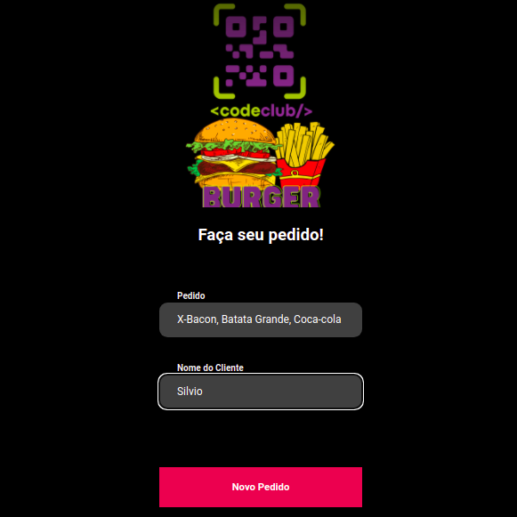
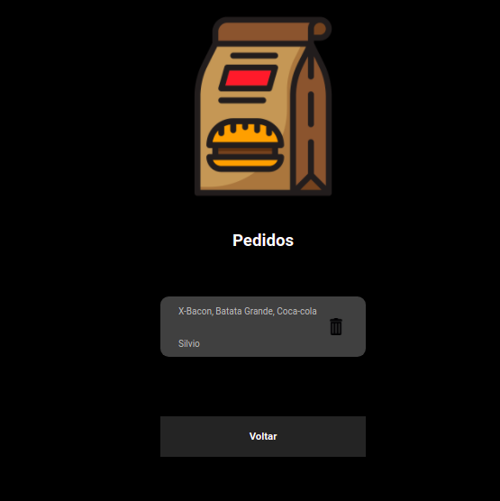
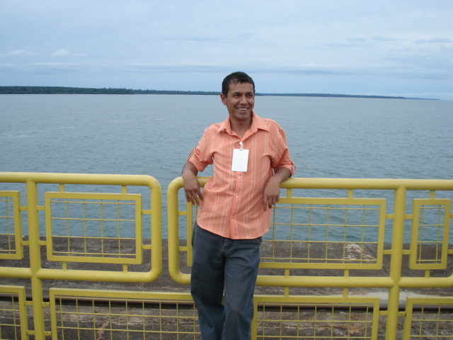

# Front-desafio-React 

<a href="https://www.instagram.com/silviolopesdias/">

<a href="https://www.facebook.com/silvio.lopesdias.9/" > 

<a href="https://www.linkedin.com/in/silvio-lopes-dias-69bbba214/">
 

 

 
  

> Este projeto teve por objetivo colocar em prática  habilidades no HTML e CSS e Javascript e React.

### Ajustes e melhorias

O projeto esta pronto
  
  
### Link para o projeto Back-React-Node
  
 https://github.com/silviolopesdias/Back-desafio-react

## 🤝 Colaboradores

Agradecemos às seguintes pessoas que contribuíram para este projeto:

<table>
  <tr>
    <td align="center">
      <a href="#">
         
        
          <b> Silvio Lopes</b>
        
      </a>
    </td>   
  </tr>
</table>

[⬆ Voltar ao topo](#First-React) 

## Available Scripts

In the project directory, you can run:

### `yarn start`

Runs the app in the development mode.\
Open [http://localhost:3000](http://localhost:3000) to view it in the browser.

The page will reload if you make edits.\
You will also see any lint errors in the console.

